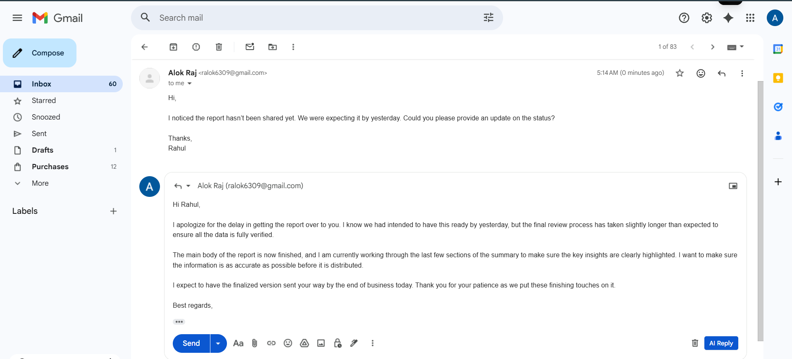
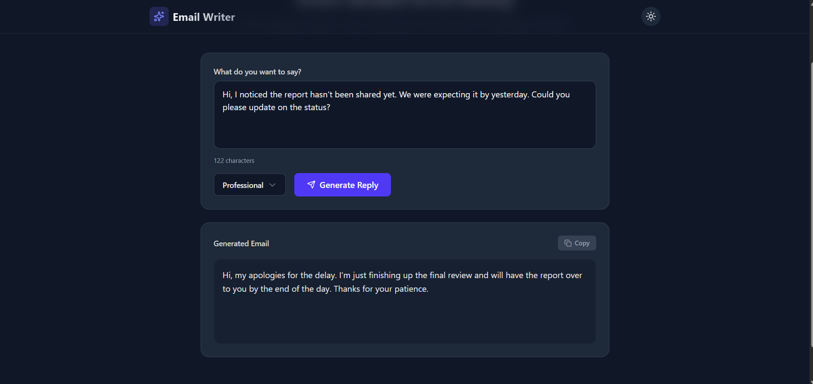
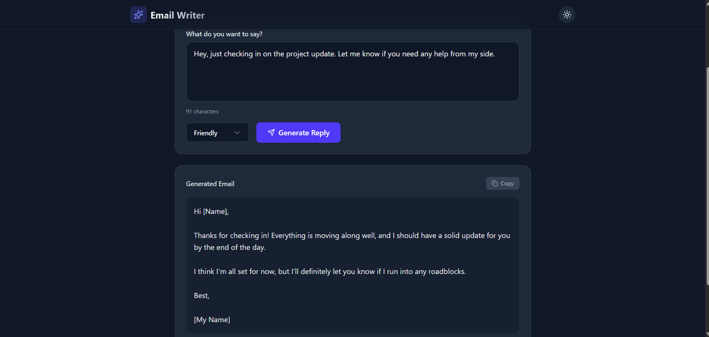
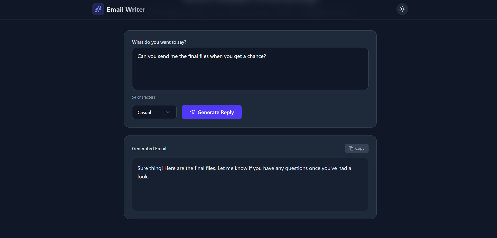
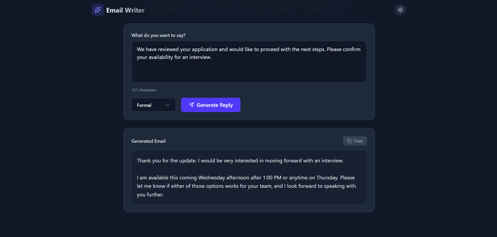

# ✉️ AI Email Writer Assistant

An AI-powered email reply generator with a modern React frontend and a Chrome Extension that integrates directly into Gmail.

---

## 🚀 Features

* Generate human-like email replies instantly
* Supports multiple tones:

  * Professional
  * Casual
  * Friendly
  * Formal
* Chrome extension integrated directly into Gmail
* Context-aware responses (no hallucinations)
* Copy-to-clipboard support
* Loading spinner + error handling
* Responsive design (mobile + desktop)
* Dark mode support

---

## 🏗️ Tech Stack

### 🔹 Backend

* Java + Spring Boot
* WebClient (Reactive API calls)
* Google Gemini API

### 🔹 Frontend

* React (Vite)
* Tailwind CSS
* Axios

### 🔹 Chrome Extension

* Manifest v3
* Content Scripts + MutationObserver
* Gmail DOM integration

---

## 📂 Project Structure

```
email-writer/
│
├── email-writer-backend/
├── email-writer-frontend/
├── email-writer-ext/
├── screenshots/
├── README.md
└── .gitignore
```

---

## ⚙️ How It Works

1. User writes or opens an email in Gmail or UI
2. Selects tone
3. Clicks **Generate**
4. Frontend/Extension sends request to backend
5. Backend calls Gemini API
6. AI-generated reply is returned
7. Response is displayed or injected into Gmail

---

## 📡 API Endpoint

POST `/api/email/generate`

### Request

```json
{
  "emailContent": "Your email text",
  "tone": "professional"
}
```

### Response

```
Plain text email reply
```

---

## 🔐 Environment Variables

### Backend (`application.properties`)

```properties
spring.application.name=email-writer

gemini.api.url=${GEMINI_API_URL}
gemini.api.key=${GEMINI_API_KEY}
```

### Required Environment Variables

```
GEMINI_API_URL=https://generativelanguage.googleapis.com/v1beta/models/gemini-1.5-flash:generateContent
GEMINI_API_KEY=your_api_key_here
```

---

### Frontend (`.env`)

```
VITE_API_BASE_URL=http://localhost:8080
```

---

## 💻 Frontend Setup (React + Vite)

```bash
cd email-writer-frontend
npm install
npm run dev
```

Runs on:

```
http://localhost:5173
```

---

## ⚙️ Backend Setup

```bash
cd email-writer-backend
./mvnw spring-boot:run
```

Runs on:

```
http://localhost:8080
```

---

## 🧩 Chrome Extension Setup

1. Open Chrome
2. Go to: `chrome://extensions/`
3. Enable **Developer Mode**
4. Click **Load unpacked**
5. Select `email-writer-ext/`

---

## 🖼️ Screenshots

### 📧 Gmail Integration



### 💼 Professional Tone



### 😊 Friendly Tone



### 🧑‍💻 Casual Tone



### 🏢 Formal Tone



---

## 🧪 Tested Scenarios

* Apology / delay emails
* Interview responses
* Complaint handling
* Friendly follow-ups
* General requests

---

## 🎯 UX Features

* Disabled button when input is empty
* Smooth loading state
* Character counter
* Toast notifications
* Clean spacing and typography

---

## 📌 Future Improvements

* Email summarization
* Multi-language support
* Smart reply suggestions
* Thread/context awareness
* Deployment (cloud hosting)

---

## 👨‍💻 Author

Alok Raj
